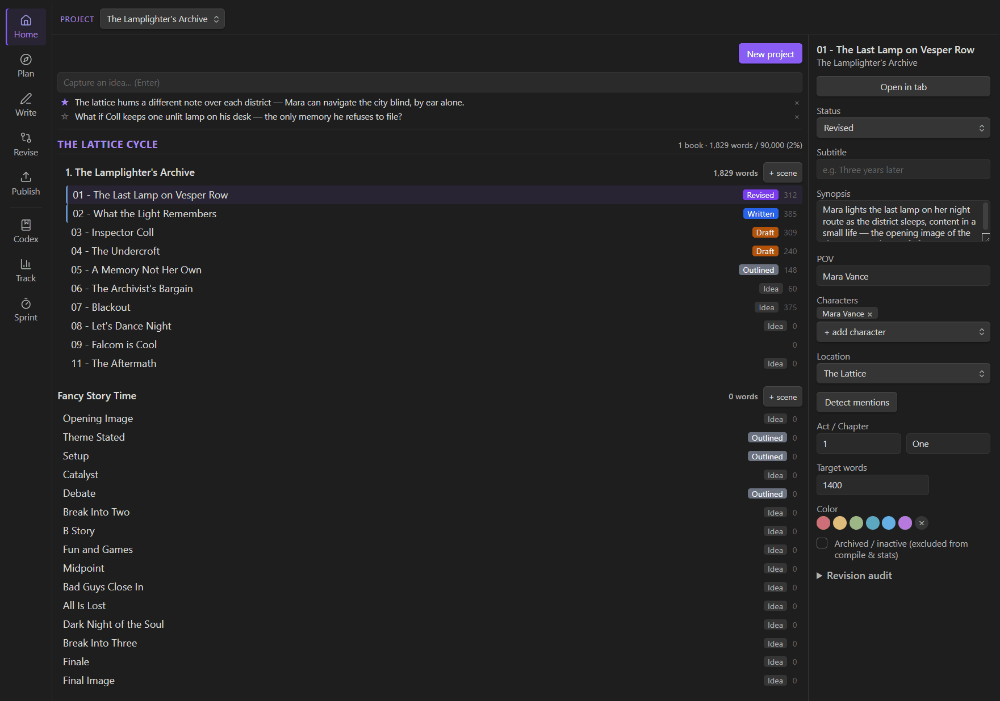
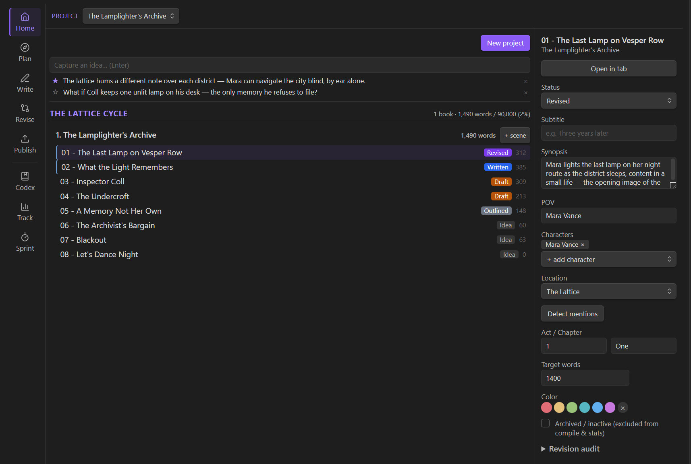
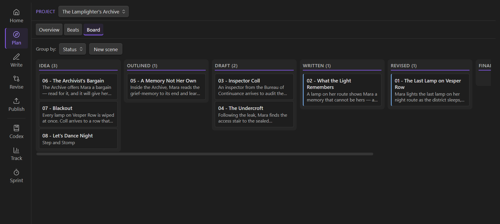
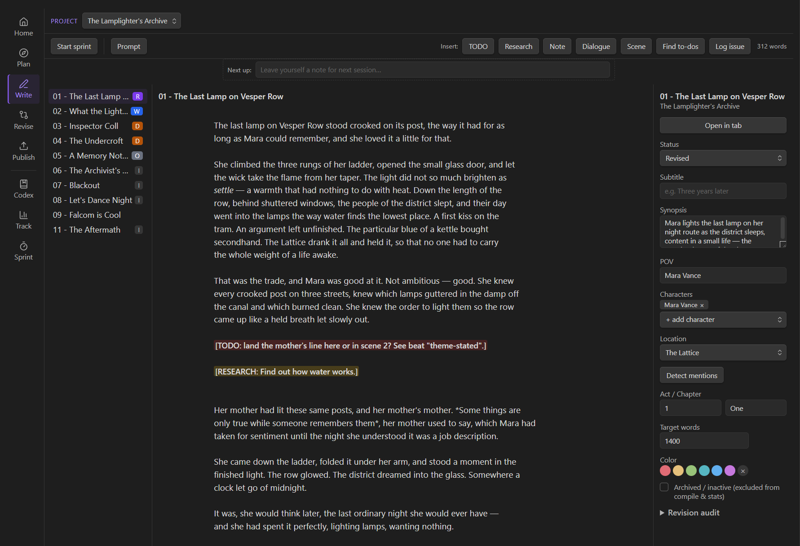
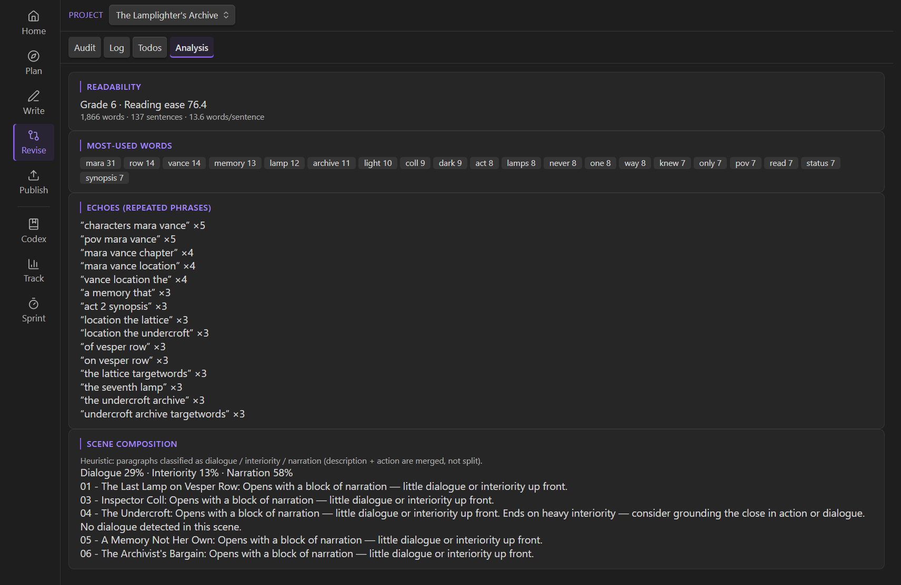
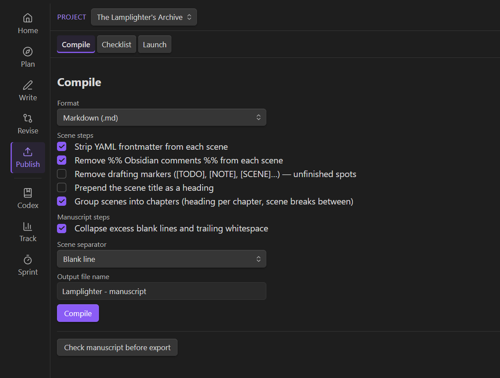
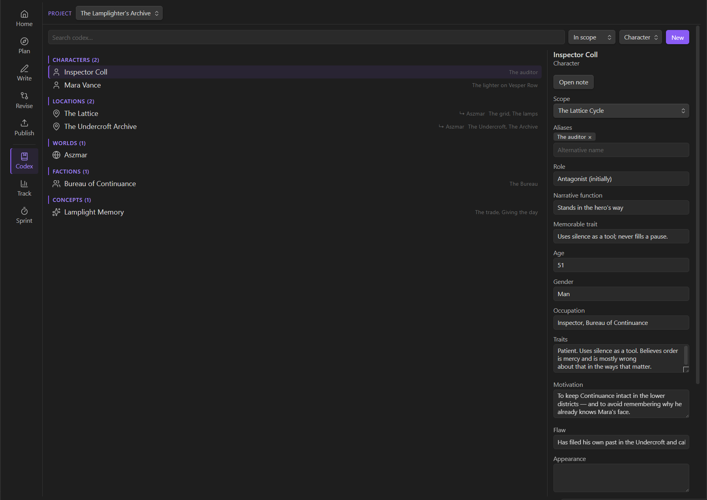
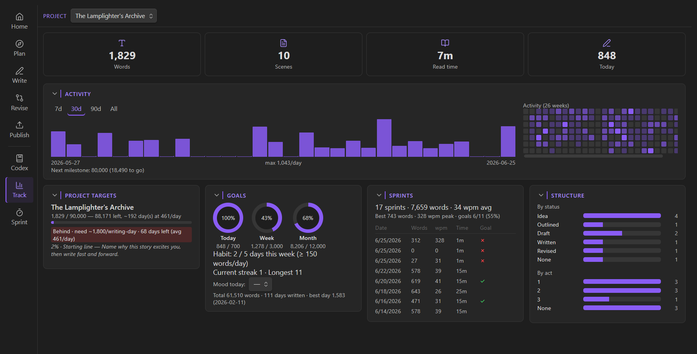

<!--
  ───────────────────────────────────────────────────────────────────────────
  SCREENSHOT SHOT-LIST  (capture from examples/sample-vault — "The Lamplighter's
  Archive" — so every shot shows populated, real-looking content, not empty UI)
  ───────────────────────────────────────────────────────────────────────────
  assets/hero.gif    — short loop tabbing Home → Plan → Write → Track → Revise →
                       Publish. The 4-second "look how much this does" shot.
  assets/track.png   — Track dashboard: GitHub-style heatmap + streak + progress
                       rings + word-history chart. Most visually arresting frame.
  assets/home.png    — project list + nestable scene tree + project switcher.
  assets/plan.png    — Kanban Board grouped by status, colored scene cards.
                       (Beat sheet or a Codex character profile is a fine alt.)
  assets/write.png   — Live-Preview editor with placeholder tokens HIGHLIGHTED
                       ([TK], [DIALOGUE: …]) + sprint timer running. Annotate the
                       token highlighting — it's invisible unless pointed at.
  assets/revise.png  — Audit toolkit: character-arc grid or per-scene revision
                       checklist dashboard.
  assets/publish.png — compile/export step editor, or the Launch pre-order timeline.
  assets/codex.png   — a Codex entry profile (e.g. a character) with its linked scenes.

  Craft: crop tight to the Inkswell panel but leave a sliver of Obsidian visible;
  use a clean common theme (default dark); keep GIF small. See examples/README.md
  for deploying the sample vault.
  ───────────────────────────────────────────────────────────────────────────
-->

# Inkswell

**A local-first writer's suite for longform fiction in [Obsidian](https://obsidian.md).** Plan it, draft it, track it, revise it, and publish it — without leaving your vault, and without your words ever leaving your machine.

<!-- HERO -->


## Why Inkswell

- **The whole lifecycle in one plugin.** Most tools cover one or two stages. Inkswell organizes the entire arc of a novel — **Home · Plan · Write · Revise · Publish**, plus a cross-cutting **Codex** and **Track** dashboard — into a single host view. Think Scrivener-class project management, but native to Obsidian and local-first.
- **Local-first. No AI.** Inkswell makes **no network calls**, collects **no telemetry**, and generates **nothing** for you. Your manuscript lives in your vault's frontmatter and the plugin's local `data.json` — and nowhere else. Inkswell supports your writing but does not do any writing for you.
- **Drop-in for Longform users.** Inkswell reads and writes the same `longform` frontmatter, so existing projects load with **zero migration**. Inkswell-only data lives under a separate `inkswell` key and never touches your prose.

## What's inside

Five pipeline phases — **Home · Plan · Write · Revise · Publish** — plus two cross-cutting tools, **Codex** and **Track**, that you reach for at any stage.

| Surface | What it's for |
|---------|---------------|
| **Home** | Projects, a nestable scene tree, ideas inbox + quick capture, and series grouping for multi-book worlds. |
| **Plan** | Beat sheets (7 outline templates incl. Save the Cat!) and a Kanban Board (by status / act / POV). |
| **Write** | A distraction-light Live-Preview editor, writing prompts, fast-drafting placeholder tokens, and timed sprints. |
| **Revise** | An Audit toolkit, the invisible-revision Log, a placeholder Gaps sweep, Comments extraction, and manuscript Analysis. |
| **Publish** | A configurable compile/export pipeline plus a self-publishing checklist and launch planner. |
| **Codex** | A story bible — characters, locations, worlds, factions, items, events, and concepts — with scene linking and mention auto-detect. |
| **Track** | Word goals, streaks, a GitHub-style heatmap, lifetime records, a deadline pace calculator, and milestone zones. |

### Home — organize the whole world

Projects and a nestable scene tree, an ideas inbox with quick capture, and series grouping for multi-book worlds, all behind a global project switcher.

<!-- HOME -->


### Plan — structure before you draft

*Beats* (7 outline templates incl. Save the Cat!, with scene scaffolding) and a *Board* (Kanban by status / act / POV).

<!-- PLAN -->


### Write — draft fast, fix later

A distraction-light, Live-Preview manuscript editor with writing prompts and timed **sprints**. Fast-drafting **placeholder tokens** — `[TK]`, `[SCENE: …]`, `[DIALOGUE: …]`, `[NOTE: …]` — highlight as you type, so you can mark a gap and keep moving instead of stalling. Find them all later in the Revise → Gaps sweep.

<!-- WRITE -->


### Revise — the part most tools skip

- **Audit** — per-scene and project revision checklists, a scene-purpose lift-out test, scene-opening variety, a character-arc grid, a side-character roster, and a style-sheet consistency scan.
- **The invisible-revision Log** — capture *"from now on, assume X"* decisions (e.g. "the inn is now called the Gilded Wren") as typed, prioritized entries and **keep drafting forward** instead of breaking flow to backfill earlier chapters. This is the feature writers tell us they didn't know they needed.
- **Gaps** — a one-click sweep of every placeholder token across the manuscript.
- **Comments** — extract inline `%%` / `@@` notes into a clickable list.
- **Analysis** — readability, overused words, echoes, and composition mix.

<!-- REVISE -->


### Publish — manuscript to market

A configurable **compile/export** pipeline (Markdown & HTML built in; `.docx` / `.pdf` / `.epub` via pandoc when installed) with a step editor, chapter grouping, and a pre-export check. Plus a self-publishing **Checklist** (master checklist + book-metadata worksheet) and a **Launch** planner — pre-order timeline, budget, cover, marketing, and ARC trackers.

<!-- PUBLISH -->


### Codex — your story bible

Characters, locations, worlds, factions, items, events, and concepts, each with its own profile and linked scenes, plus mention auto-detect so your canon stays consistent as the manuscript grows. It's reference material you reach for across Plan, Write, and Revise — so it sits alongside the pipeline rather than inside any one phase.

<!-- CODEX -->


### Track — see the habit, not just the wordcount

Daily / weekly / monthly word goals, habit streaks, a GitHub-style heatmap, lifetime records, a writing-history chart, sprint stats, a **deadline pace calculator** (required daily words, ahead / on-track / behind), draft-milestone zones, and an optional daily mood.

<!-- TRACK -->


> The invisible-revision method, the fast-drafting aids, the revision audit, and the self-publishing workflow draw on established, widely-taught craft methods for drafting, revising, and self-publishing fiction.

## Privacy & dependencies

- **Local-first.** No network calls, no telemetry, no account. Everything is stored in your vault's frontmatter and the plugin's local `data.json`.
- **No AI.** By design — Inkswell is tooling around your writing. It cannot generate any text.
- **Optional pandoc.** Exporting to `.docx` / `.pdf` / `.epub` shells out to a [pandoc](https://pandoc.org/) binary on your machine. It's feature-detected and disabled gracefully when pandoc isn't present; Markdown and HTML export need nothing extra.
- **Desktop-only** for now (`isDesktopOnly`). A focused mobile view (idea capture + read-only review) is planned for a future release.

## Install

**Requirements:** Obsidian 1.7.2+ (pandoc optional, for `.docx` / `.pdf` / `.epub`).

- **Community plugins:** Settings → *Community plugins* → *Browse* → search **Inkswell** → Install → Enable.
- **Manual:** download `main.js`, `manifest.json`, and `styles.css` from the latest [release](https://github.com/leethobbit/obsidian-inkswell-plugin/releases) into `<vault>/.obsidian/plugins/inkswell/`, then enable Inkswell in *Community plugins*.

Open Inkswell from the pen-tip ribbon icon or the *"Open Inkswell"* command.

## Try it: the sample vault

[`examples/sample-vault/`](examples/) is a complete, openable vault containing a mid-draft novel — *The Lamplighter's Archive* — wired up to exercise every Inkswell surface: beats, scenes, Codex, a populated Track dashboard, the revision audit, a compile recipe, and the self-publishing planner. Run `npm run build:sample`, then *Open folder as vault* on `examples/sample-vault`. See [examples/README.md](examples/README.md) for details.

## Development

```bash
npm install
npm run dev      # watch build into main.js
npm run build    # typecheck + production bundle
npm test         # unit tests (vitest)
```

Copy `main.js`, `manifest.json`, and `styles.css` into `<vault>/.obsidian/plugins/inkswell/` to test in a real vault. Architecture, conventions, and the compile/version workflows are documented in [AGENTS.md](AGENTS.md).

## AI disclosure

This plugin was developed with the assistance of **agentic AI coding tools and practices**. I have a mandate at work to learn AI tooling, and I wanted to channel that practice into something of lasting value for a community I love rather than throwaway exercises. Direction, architecture, scope, and review are all handled by me; much of the implementation was AI-assisted under that direction. Everything is open source (MIT) and the full commit history is here for inspection — feedback and scrutiny are welcome.

## License

MIT © Daniel King
